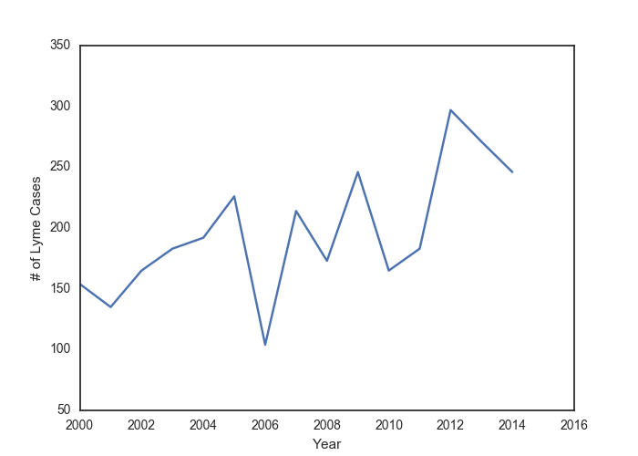
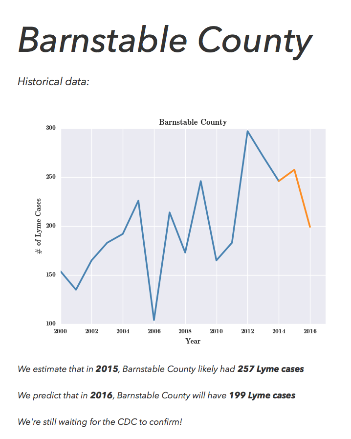

# The Lyme Forecast

Lyme disease is a major public health concern, affecting 30,000–300,000 people per year in the United States, mostly in the northeast and upper midwest. When left untreated, it can become a painful chronic condition for sufferers. However, treatment with antibiotics is straightforward when the infection is caught early, and so it is important for health practitioners and the general public to be informed about the early symptoms of Lyme disease, and methods for limiting exposure to disease vectors.

One aspect of Lyme disease that is often under-appreciated is how much it can vary from year-to-year. For instance, here's the number of Lyme cases is Barnstable County, Massachusetts, from 2000–2014.

You can see that at several times during this time period, the number of cases of Lyme doubled from year-to-year, or crashed just as dramatically. That can make it difficult to anticipate what a coming year may bring.

I've built a web-app called **The Lyme Forecast**, which primarily uses climate data to predict the prevalence of Lyme disease through time.

## The Lyme Forecast web-app

You can find The Lyme Forecast at [www.lymeforecast.us](www.lymeforecast.us).

Just select a county that you are interested in, and the app will show historical Lyme data for that county, as well as a projection for what Lyme dynamics were likely encountered in 2015–2016, which the CDC have not released data for yet.

## Model and data

* Lyme disease data at the county level was obtained from the CDC's [Lyme disease data page](http://www.cdc.gov/lyme/stats/index.html).
* Climate data was obtained from [PRISM](http://www.prism.oregonstate.edu).
    * This raw climate data was then engineered into 19 biologically relevant features (Bioclim) using [an R script](https://github.com/aredoubles/Extract_BioClim), particularly the `dismo` package.
    * The climate features within each county were then summarized using the `RasterStats.py` script here, leveraging the `rasterio` Python package.
    * Once processed, all data was stored in a PostgreSQL database
* Population data for each county was obtained from the Socioeconomic Data and Applications Center (SEDAC), specifically the [Gridded Population of the World](http://sedac.ciesin.columbia.edu/data/collection/gpw-v4) project.
    * This data was summarized within counties using the `PopZones.py` script, again using the `rasterio` Python package, and stored in a Postgres database.
* Lyme disease, climate, and population data was then combined using the `CountyBuild.py` script, and stored in the Postgres database.
* In total, this project produced 550+ data tables that needed to be managed! 300+ of those tables needed to be queried in order to begin running analyses.
* The data was analyzed using a Random Forest Regression algorithm, using climate and population features to explain the number of cases of Lyme disease in each county and year.
    * The algorithm was trained on a subset of the data, then performance was validating on a remaining subset.
        * On this validation set, the algorithm produced an R^2 value of 0.78, which is quite good!

Slides explaining this data management and modeling process are also [available as part of the web-app](http://lymeforecast.us/about).

## About
* Roger Shaw
* Currently a fellow at Insight Health Data Science, transitioning from academia into a career in data science
